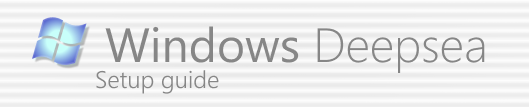
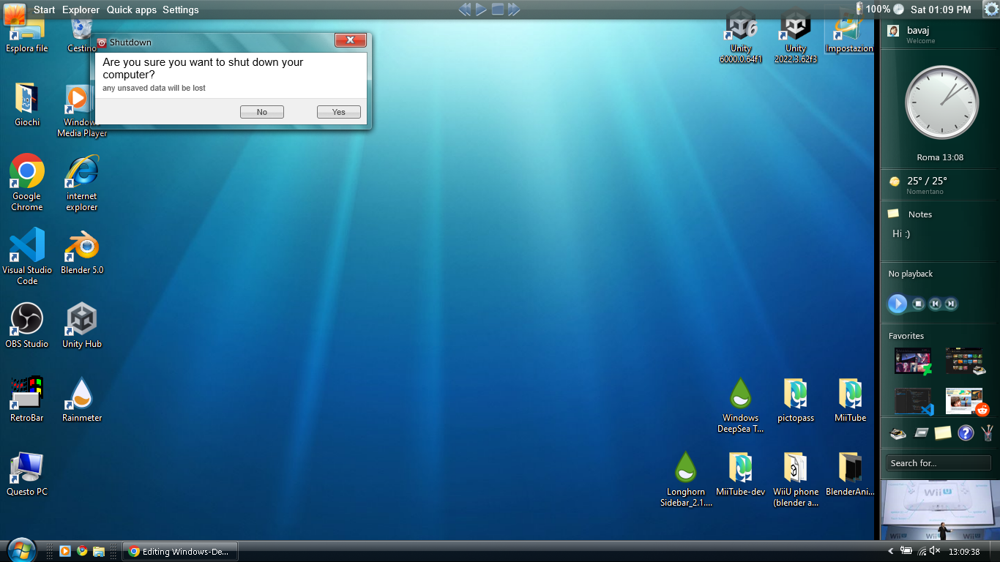

## Introduction & Info
### Compatibility
i' ve only tested all this stuff on Windows10 22H2 (to check your windows version press Win+r on your keyboard and write "winver"), but should work also in:  
Topbar:  
Win7, Win8, Win10, Win11  

Other stuff:  
check the corresponding websites (you can find them in [README.md](../README.md]))

### Final result
after you've followed this guide, you should get something like this:  

## Setup
### 1. Download the customization' s files
 - In the main page of this repository, go to ["Releases"](https://github.com/Jacane-123/Windows-DeepSea/releases)
 - Go to the latest release
 - Download "Source code (zip)" under the "Assets" section
 - Open the File explorer and unzip the file you just downloaded

### 2. Setting up RetroBar
 - Open the unzipped folder
 - Open the "Windows-Deepsea/Customizations/Programs" folder
 - Open "RetroBarInstaller.exe"
 - Install RetroBar (follow the setup process)
 - Open Retrobar
 - Now your TaskBar should be changed
 - Right-clik the taskbar
 - Select "Properties"
 - In the "theme" section, select "Windows Vista Aero"

### 3. Setting up OpenShell
 - Open the "Windows-Deepsea/Customizations/Programs" folder
 - Open "OpenShellSetup_4_4_196.exe"
 - Install OpenShell (follow the setup process)
 - Open OpenShell (or ClassicShell)
 - Exit from Retrobar (right-click on the taskbar and select "exit")
 - Right-click on the button for the start menu
 - Select "Settings"
 - Go to the "Theme" tab
 - Select "Windows Aero"
 - Press "OK"
 - Now your StartMenu should be changed
 - Open RetroBar

### 4. Setting up Rainmeter
 - If you don' t already have it, [install Rainmeter](https://www.rainmeter.net/)
 - Now some widgets should have appeard on your desktop
 - Right-click them and select "Remove skin" to remove them

### 5. Setting up the TopBar
 - Open the "Windows-Deepsea/Customizations/Rainmeter Skins" folder
 - Install "Windows DeepSea TopBar_Alpha 0.1.rmskin"

### 6. Setting up the SideBar
 - Open the "Windows-Deepsea/Customizations/Rainmeter Skins" folder
 - Install "Longhorn Sidebar_2.1.5.rmskin"

## Customization
### How to customize RetroBar
 - If you haven't done it yet, open Retrobar
 - Right-click the taskbar
 - Select "Properties"

### How to customize OpenShell
 - If you haven't done it yet, open OpenShell
 - If you haven't done it yet, close RetroBar
 - Right-click the button for the start menu
 - Select "Settings"
 - When you've done, click "OK"
 - Open RetroBar

### How to customize the TopBar
 **- Moving elements:**
  - You can simply drag items wherever you want from your desktop

 **- Adding/removing elements:**
  - Right-click the skin
  - Select "Manage skin" to open the "Manage Rainmeter Window"
  - From here you can add or remove elements

### How to customize the SideBar
 **- Moving elements:**
  - You can simply drag items wherever you want from your desktop

 **- Adding/removing elements:**
  - Right-click the skin
  - Select "Manage skin" to open the "Manage Rainmeter Window"
  - From here you can add or remove elements
